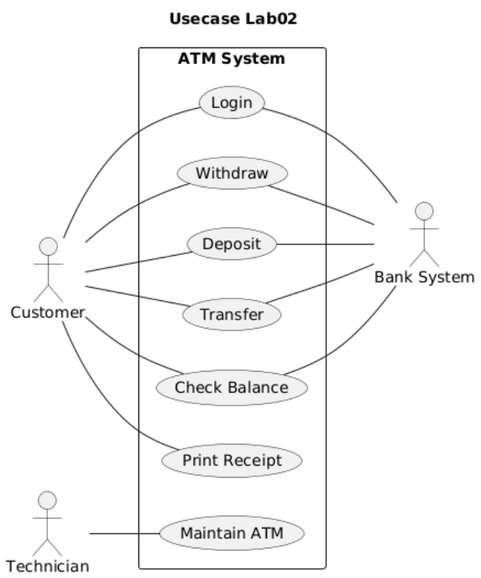
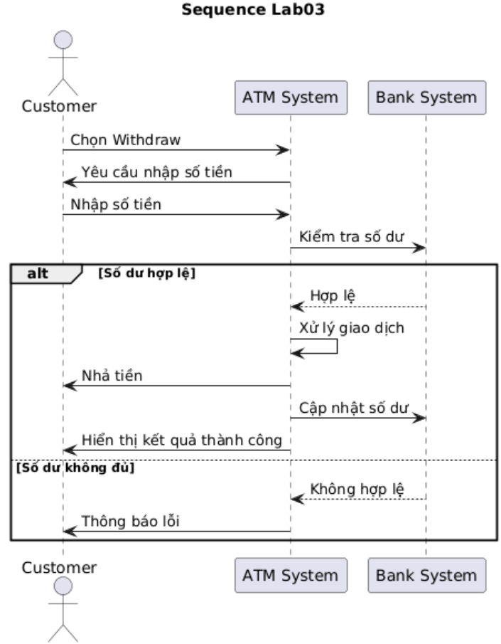

# Software Engineering Project – Hệ thống ATM

## Giới thiệu
Dự án này được phát triển trong môn **Nhập môn Công nghệ Phần mềm**.  
Mục tiêu là áp dụng quy trình phát triển phần mềm, từ **phân tích yêu cầu, thiết kế, lập trình, kiểm thử và triển khai**.

## Thành viên nhóm 6
- **Nguyễn Vũ Thanh Bình** – N23DCPT006
- **Nguyễn Hạnh Nhân** – N23DCPT040 
- **Huỳnh Lưu Bảo Trân** – N23DCPT051

## Use Case chính
- Quản lý người dùng  
- Quản lý sản phẩm/dịch vụ  
- Xử lý giao dịch  
- Báo cáo & thống kê  

## Thiết kế hệ thống
- **Use Case Diagram:**   
- **Sequence Diagram:**   
- **ERD (Entity Relationship Diagram):** *(chèn hình nếu có)*  

## Công nghệ sử dụng
- **Ngôn ngữ:** Python / Java / JavaScript (tùy chọn)  
- **Cơ sở dữ liệu:** MySQL  
- **Công cụ:** GitHub, Visual Studio Code  
